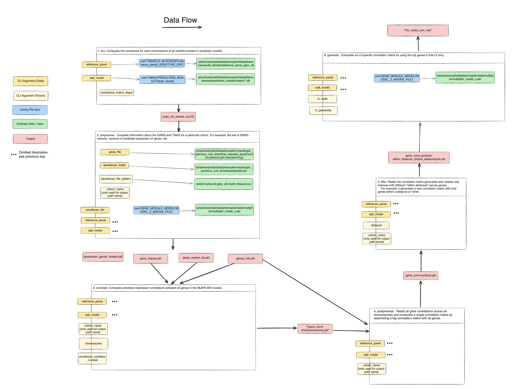

.. _gene-gene-correlation-matrix-computation:

Gene Gene Correlation Matrix Computation
===============

This function allows you to compute the correlation matrix between genes based on their expression profiles.

The whole process is divided into six steps. Some steps may be time consuming, depending on the size of the input data.

To illustrate the process and data flow, refer to this draft diagram:

.. toctree::
   :maxdepth: 1

   step1-compute-covariance
   step2-preprocess
   step3-predict-correlation
   step4-postprocess
   step5-create-filtered-matrices
   step6-generate-correlation-matrices-per-lv
   