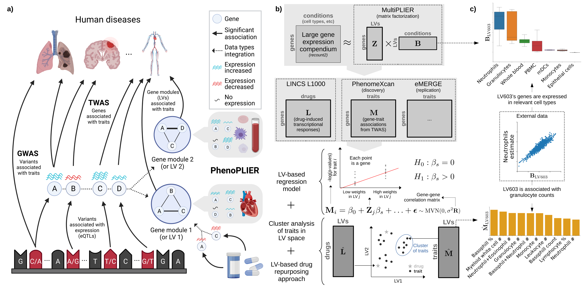

Introduction    
============

This package serves as a command-line interface (CLI) for the `PhenoPLIER <https://github.com/haoyu-zc/phenoplier?tab=readme-ov-file>`_ project. 
PhenoPLIER is a flexible computational framework that combines gene-trait and gene-drug associations with gene modules expressed in specific contexts. 
This CLI program aims to provide a more user-friendly interface for users to interact with the PhenoPLIER project and integrate it into their own computational pipelines.

For now, the CLI provides the following functionalities:

1. LV-trait regression: using an LV-based regression mode to compute an association between an LV and a trait
2. Gene-gene correlation matrix computation: compute the correlation matrix between genes based on their expression profiles

For Function 1: :ref:`lv-trait-regression`, you will use the model and correlation matrices we provide.

If you prefer to use your own model, first use Function 2: :ref:`gene-gene-correlation-matrix-computation` to compute correlation matrices based on your model. Then, supply both your model and matrices to Function 1 to perform the regression.
